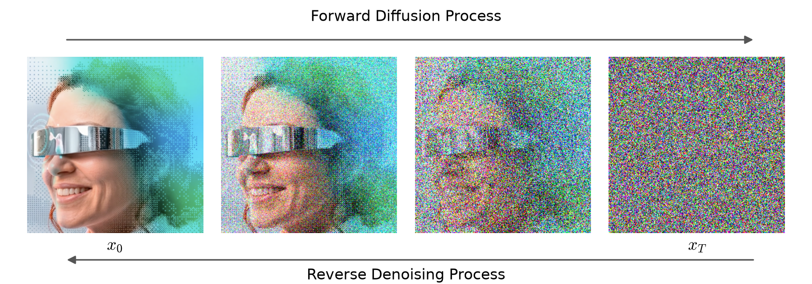
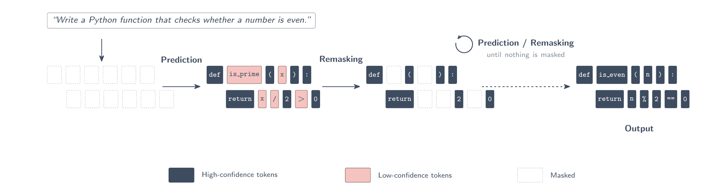

# Diffusion language models: code for the blog post

Code for [Diffusion Language Models: Beyond Left-to-Right Generation](https://www.codecentric.de/en/knowledge-hub/blog/diffusion-language-models-beyond-left-to-right-generation-en). Each file matches one section of the post.

## In short

Autoregressive LLMs generate one token at a time, left to right, and never revise. Diffusion language models (DLMs)
take the approach of image diffusion: start from noise and denoise step by step.



For text, the noise is a sequence of masked positions. In each step the model predicts every masked token at once,
keeps the confident ones and remasks the rest, until nothing is masked. Because every position sees the whole sequence,
the end can inform the beginning, and the number of steps sets the trade-off between speed and quality.



## Code

| Section                 | File                                                                                                                       |
| ----------------------- | -------------------------------------------------------------------------------------------------------------------------- |
| Calling a DLM via API   | [`diffusion_api.py`](diffusion_api.py): Mercury 2.5, plain call and the denoising steps (`diffusing=True`)                 |
| DLMs as decision models | [`celeris_decision.py`](celeris_decision.py): typed questions (`Noul`, `Choice`, `Score`) against `celeris-1-decision`     |
| How good are they?      | [`benchmark/`](benchmark): celeris-1-decision vs. mercury-decide on Typed Decisions, [report](benchmark/results/report.md) |

## Setup

Requires [uv](https://docs.astral.sh/uv/).

```bash
uv sync
cp .env.example .env    # add INCEPTION_API_KEY and CELERIS_API_KEY
```

## Run

```bash
uv run diffusion_api.py
uv run celeris_decision.py
```

The benchmark has its own [README](benchmark/README.md) with the commands and the metrics.

## Results: decision models

[Typed Decisions](https://huggingface.co/datasets/LocalLLaMA/typed-decisions) test split, 400 cases, 2,000 decisions.
Diffusion models in bold; the other rows are taken from the dataset card's zero-shot leaderboard. Full report with
intervals and calibration: [`benchmark/results/report.md`](benchmark/results/report.md).

| #   | Model                  | Accuracy ↑ | KL ↓  | Brier ↓ | p50 latency |
| --- | ---------------------- | ---------- | ----- | ------- | ----------- |
| 1   | meraGPT Decider 1      | 0.768      | 0.096 | 0.052   | 526 ms      |
| 2   | Liquid AI d1           | 0.742      | 0.475 | 0.155   | 525 ms      |
| 3   | **celeris-1-decision** | 0.739      | 0.214 | 0.108   | 243 ms      |
| 4   | TypeSafe Jev 1.13.0    | 0.727      | 1.442 | 0.148   | 710 ms      |
| 5   | Featherless Simple Jev | 0.716      | 0.488 | 0.176   | –           |
| 6   | **mercury-decide**     | 0.715      | 0.967 | 0.271   | 409 ms      |
